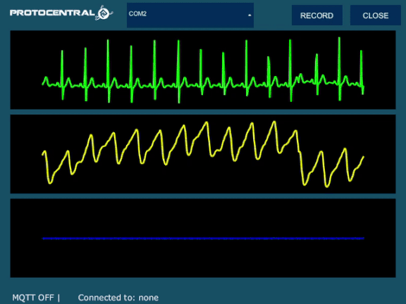

# ProtoCentral OpenView

ProtoCentral OpenView is a graphical interface for MacOS/Linux/Windows for plotting/storing sensor data from ProtoCentral breakout boards and shields. This software is meant to be used with a device that presents a serial UART interface, such as an Arduino.

For compiled binaries, please check the **releases** tab above.

## Features:

* Development environment: [Processing 3](https://processing.org/)
* Compatibility:** MacOS/Linux/Windows
* Data storage option to text or CSV files
* Default baud rate is 57,600 bps
* You can add your own board by editing the .pde file

## Installing and using ProtoCentral OpenView

ProtoCentral OpenView is available for Windows, MacOS and Linux.

You can download the latest version for your operating system from the [Releases](https://github.com/Protocentral/protocentral_openview/releases) page. 

OpenView is written on the [Processing Java IDE](https://processing.org/download/) and is fully open source. You can compile your own from the source code provide in this GitHub repository. 

### Processing library dependencies

* ControlP5 GUI library
* Grafica

You can install these from Processing through (Sketch->Import Library->Add Library).

## Supported devices

As of now, this application supports the following boards:
* ProtoCentral [MAX86150 PPG and ECG breakout](https://protocentral.com/product/protocentral-max86150-ppg-and-ecg-breakout-with-qwiic-v2/)
* ProtoCentral [AFE4490 Breakout board](https://protocentral.com/product/protocentral-afe4490-pulse-oximeter-breakout-board-kit/) and [AFE4490 Arduino shield](https://protocentral.com/product/protocentral-afe4490-pulse-oximeter-shield-for-arduino-v2/)

Support will be added for more boards in the future.

# License

This software is open source and licensed under the following license:

MIT License

Copyright (c) 2019 ProtoCentral

Permission is hereby granted, free of charge, to any person obtaining a copy
of this software and associated documentation files (the "Software"), to deal
in the Software without restriction, including without limitation the rights
to use, copy, modify, merge, publish, distribute, sublicense, and/or sell
copies of the Software, and to permit persons to whom the Software is
furnished to do so, subject to the following conditions:

The above copyright notice and this permission notice shall be included in all
copies or substantial portions of the Software.

THE SOFTWARE IS PROVIDED "AS IS", WITHOUT WARRANTY OF ANY KIND, EXPRESS OR
IMPLIED, INCLUDING BUT NOT LIMITED TO THE WARRANTIES OF MERCHANTABILITY,
FITNESS FOR A PARTICULAR PURPOSE AND NONINFRINGEMENT. IN NO EVENT SHALL THE
AUTHORS OR COPYRIGHT HOLDERS BE LIABLE FOR ANY CLAIM, DAMAGES OR OTHER
LIABILITY, WHETHER IN AN ACTION OF CONTRACT, TORT OR OTHERWISE, ARISING FROM,
OUT OF OR IN CONNECTION WITH THE SOFTWARE OR THE USE OR OTHER DEALINGS IN THE
SOFTWARE.
