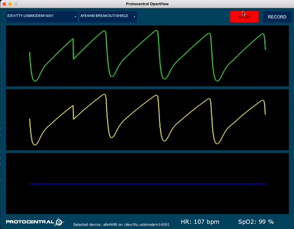

# ProtoCentral OpenView

ProtoCentral OpenView is a unified graphical interface for MacOS/Linux/Windows for plotting/storing sensor data from most of ProtoCentral's breakout boards and shields. This software is meant to be used with a device that presents a serial UART interface, such as an Arduino. The software is written entirely in [Processing](https://processing.org/) and fully extensible to read data from your own boards also.

## Features:

* Multiple boards, one unified interface 
* Adaptable data packet format according to type of board used
* Development environment: [Processing 3 / 4 Java](https://processing.org/)
* Compatibility: MacOS/Linux/Windows
* Data storage option to text or CSV files
* Default baud rate is 57,600 bps
*
* You can add your own board by editing the source file

## Installing and using ProtoCentral OpenView

ProtoCentral OpenView is available for Windows, MacOS and Linux.

You can download the latest version for your operating system from the [Releases](https://github.com/Protocentral/protocentral_openview/releases) page. 

OpenView is written on the [Processing Java IDE](https://processing.org/download/) and is fully open source. You can compile your own from the source code provide in this GitHub repository. 

## Compiling and running OpenView from Source

1. Install the [Processing IDE](https://processing.org/download) for your specific operating system from [here](https://processing.org/download) 
2. Install the folowing library dependencies. You can install these from Processing through (Sketch->Import Library->Add Library) and search for the name.
    * ControlP5 GUI library
    * Grafica
3. Click Run to run the application

## Supported devices

Currently, this application supports the following boards:

* ProtoCentral [ADS1292R ECG/Respiration Breakout](https://protocentral.com/product/ads1292r-ecg-respiration-breakout-kit/) and [ADS1292R ECG/Respiration Shield](https://protocentral.com/product/ads1292r-ecg-respiration-shield-for-arduino-v2/)
* ProtoCentral [ADS1293 3-channel ECG Breakout](https://protocentral.com/product/protocentral-ads1293-breakout-board/) 
* ProtoCentral [AFE4490 Breakout board](https://protocentral.com/product/protocentral-afe4490-pulse-oximeter-breakout-board-kit/) and [AFE4490 Arduino shield](https://protocentral.com/product/protocentral-afe4490-pulse-oximeter-shield-for-arduino-v2/)
* ProtoCentral [MAX30003 Breakout Board](https://protocentral.com/product/protocentral-max30003-single-lead-ecg-breakout-board-v2/)
* ProtoCentral [MAX86150 PPG and ECG breakout](https://protocentral.com/product/protocentral-max86150-ppg-and-ecg-breakout-with-qwiic-v2/)
* ProtoCentral [Pulse Express Pulse-Ox & Heart Rate Sensor with MAX32664](https://protocentral.com/product/pulse-express-pulse-ox-heart-rate-sensor-with-max32664/)
* ProtoCentral [MAX30001 ECG & BIOZ Breakout](https://protocentral.com/product/protocentral-max30001/) 

## Packet Format

ProtoCentral OpenView is compatible with any device that can send data through Serial port over UART/USB/Bluetooth-SPP/BLE

| Position      |   Value   |
| ---------     | ----------|
| 0             |   0x0A    | 
| 1             |   0xFA    |
| 2             |   Payload Length LSB  |
| 3             |   Payload Length MSB  |
| 4             |   0x02 (Type - Data)  |
| 5             |   Payload 0           |
| ..            |   Payload (...)       |
|   n           |   Payload n+5         |
| (PL Len + 5)  |   0x0B                |

# License

This software is open source and licensed under the following license:

MIT License

Copyright (c) 2019 ProtoCentral

Permission is hereby granted, free of charge, to any person obtaining a copy
of this software and associated documentation files (the "Software"), to deal
in the Software without restriction, including without limitation the rights
to use, copy, modify, merge, publish, distribute, sublicense, and/or sell
copies of the Software, and to permit persons to whom the Software is
furnished to do so, subject to the following conditions:

The above copyright notice and this permission notice shall be included in all
copies or substantial portions of the Software.

THE SOFTWARE IS PROVIDED "AS IS", WITHOUT WARRANTY OF ANY KIND, EXPRESS OR
IMPLIED, INCLUDING BUT NOT LIMITED TO THE WARRANTIES OF MERCHANTABILITY,
FITNESS FOR A PARTICULAR PURPOSE AND NONINFRINGEMENT. IN NO EVENT SHALL THE
AUTHORS OR COPYRIGHT HOLDERS BE LIABLE FOR ANY CLAIM, DAMAGES OR OTHER
LIABILITY, WHETHER IN AN ACTION OF CONTRACT, TORT OR OTHERWISE, ARISING FROM,
OUT OF OR IN CONNECTION WITH THE SOFTWARE OR THE USE OR OTHER DEALINGS IN THE
SOFTWARE.
