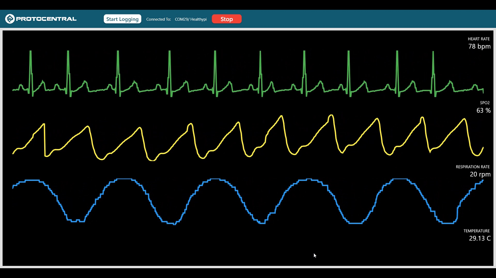
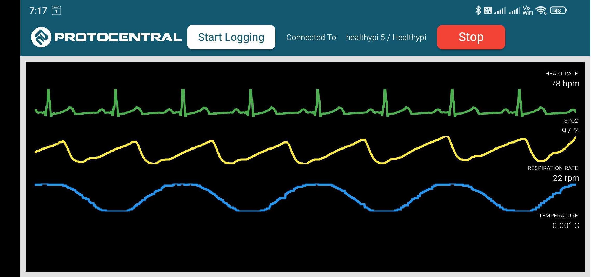
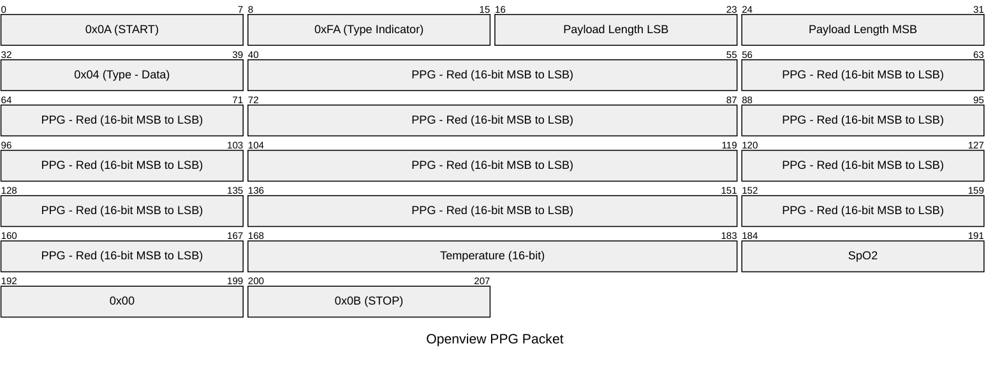

# OpenView 3

OpenView 3 is a companion application to receive data from various ProtoCentral boards. It visualizes the data in real-time and records it to `.hpd` (BIOSIG) files for later replay.

OpenView 3 is the Flutter rewrite of the original [OpenView app](https://github.com/Protocentral/protocentral_openview2) and is the primary supported app for all ProtoCentral boards. Built on the [Flutter framework](https://flutter.dev/), it runs on Windows, macOS, Linux, Android, and iOS.

OpenView 3 connects over three transports:

* **USB/UART** — desktop only; supported by every board.
* **BLE** — currently available only for the **Sensything** family.
* **Wi-Fi (TCP)** — currently available only for the **Sensything** and **HealthyPi** families.

## Features:

* Multiple boards, one unified interface
* Mobile platforms: Android and iOS
* Desktop platforms: Windows, macOS, and Linux
* USB, BLE, and Wi-Fi connectivity
* Code development environment: [Flutter](https://flutter.dev/)
* Records to `.hpd` (BIOSIG) files, round-trip compatible with HealthyPi Studio
* You can add your own board by declaring a descriptor in the source (see `lib/boards/`)

## Supported Boards
* [HealthyPi 5](https://protocentral.com/product/healthypi-5-vital-signs-monitoring-hat-kit/)
* ProtoCentral Sensything (OX and CAP)
* AFE breakouts: ADS1292R, ADS1293, AFE4490, MAX30001, MAX30003, MAX86150, Pulse Express, TinyGSR
* [TMF8829](https://protocentral.com/) dToF depth-ranging

## Installing and using ProtoCentral OpenView 3

You can download the latest version for your operating system from the [Releases](https://github.com/Protocentral/Protocentral_openview2/releases) page.

OpenView 3 is written in [Flutter](https://flutter.dev/) and is fully open source. You can compile your own from the source code provided in this GitHub repository.

### Using on Desktop Platforms:

1. Download the zip file from the [Releases](https://github.com/Protocentral/protocentral_openview2/releases) page.
2. Extract the zip file installed
3. Open the app in the folder extracted and run the application

### Using on Mobile Platforms:

Download the openview app from the [Google Play](https://play.google.com/store/apps/details?id=com.protocentral.openview) store for Android and from the [Apple App Store](https://apps.apple.com/fi/app/openview/id1667747246) for iOS.

 

## Packet Format

ProtoCentral OpenView 3 is compatible with any device that can send data through a serial port over UART/USB/Bluetooth-SPP/BLE

| Position      |   Value   |
| ---------     | ----------|
| 0             |   0x0A    | 
| 1             |   0xFA    |
| 2             |   Payload Length LSB  |
| 3             |   Payload Length MSB  |
| 4             |   0x02 (Type - Data)  |
| 5             |   Payload 0           |
| ..            |   Payload (...)       |
|   n           |   Payload n+5         |
| (PL Len + 5)  |   0x0B                |

For Healthypi 5 firmware version 1.0.0 and above, the data (ECG, Bioz and PPG) are sent as seperate packets. Below are the respective packet formats

```mermaid
  packet-beta
  title Openview ECG & Bioz Packet
   0-7: "0x0A (START)"
   8-15: "0xFA (Type Indicator)"
   16-23: "Payload Length LSB"
   24-31: "Payload Length MSB"
   32-39: "0x03 (Type - Data)"
   40-71: "ECG (32-bit MSB to LSB)"
   72-103: "ECG (32-bit MSB to LSB)"
   104-135: "ECG (32-bit MSB to LSB)"
   136-167: "ECG (32-bit MSB to LSB)"
   168-199: "ECG (32-bit MSB to LSB)"
   200-231: "ECG (32-bit MSB to LSB)"
   232-263: "ECG (32-bit MSB to LSB)"
   264-295: "ECG (32-bit MSB to LSB)"
   296-327: "Resp (32-bit MSB to LSB )"
   328-359: "Resp (32-bit MSB to LSB )"
   360-391: "Resp (32-bit MSB to LSB )"
   392-423: "Resp (32-bit MSB to LSB )"
   424-431: "Heart Rate"
   432-439: "Resp Rate"
   440-447: "0x00"
   448-455: "0x0B (STOP)"
```

```mermaid
  packet-beta
  title Openview PPG Packet
    0-7: "0x0A (START)"
    8-15: "0xFA (Type Indicator)"
    16-23: "Payload Length LSB"
    24-31: "Payload Length MSB"
    32-39: "0x04 (Type - Data)"
    40-55: "PPG - Red (16-bit MSB to LSB)"
    56-71: "PPG - Red (16-bit MSB to LSB)"
    72-87: "PPG - Red (16-bit MSB to LSB)"
    88-103: "PPG - Red (16-bit MSB to LSB)"
    104-119: "PPG - Red (16-bit MSB to LSB)"
    120-135: "PPG - Red (16-bit MSB to LSB)"
    136-151: "PPG - Red (16-bit MSB to LSB)"
    152-167: "PPG - Red (16-bit MSB to LSB)"
    168-183: "Temperature (16-bit)"
    184-191: "SpO2"
    192-199: "0x00"
    200-207: "0x0B (STOP)"
```

# License

This software is open source and licensed under the following license:

MIT License

Copyright (c) 2019 Protocentral

Permission is hereby granted, free of charge, to any person obtaining a copy
of this software and associated documentation files (the "Software"), to deal
in the Software without restriction, including without limitation the rights
to use, copy, modify, merge, publish, distribute, sublicense, and/or sell
copies of the Software, and to permit persons to whom the Software is
furnished to do so, subject to the following conditions:

The above copyright notice and this permission notice shall be included in all
copies or substantial portions of the Software.

THE SOFTWARE IS PROVIDED "AS IS", WITHOUT WARRANTY OF ANY KIND, EXPRESS OR
IMPLIED, INCLUDING BUT NOT LIMITED TO THE WARRANTIES OF MERCHANTABILITY,
FITNESS FOR A PARTICULAR PURPOSE AND NONINFRINGEMENT. IN NO EVENT SHALL THE
AUTHORS OR COPYRIGHT HOLDERS BE LIABLE FOR ANY CLAIM, DAMAGES OR OTHER
LIABILITY, WHETHER IN AN ACTION OF CONTRACT, TORT OR OTHERWISE, ARISING FROM,
OUT OF OR IN CONNECTION WITH THE SOFTWARE OR THE USE OR OTHER DEALINGS IN THE
SOFTWARE.
