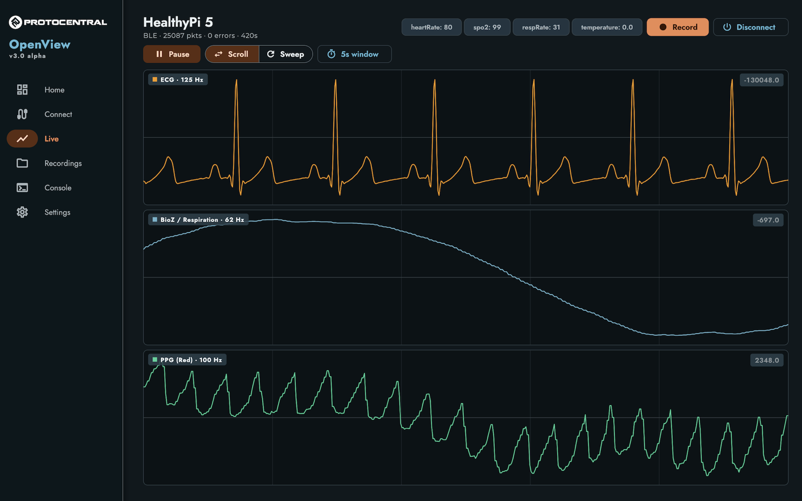
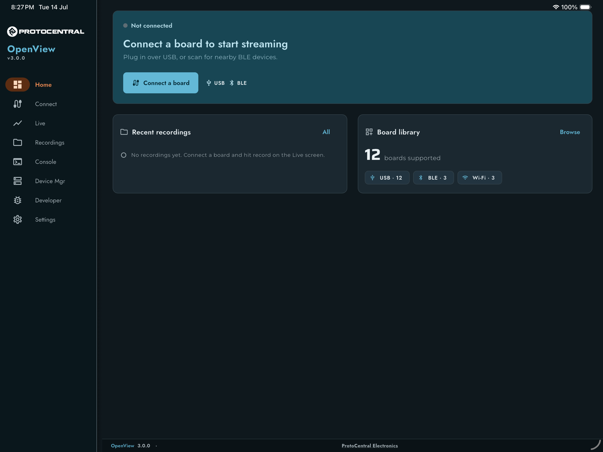
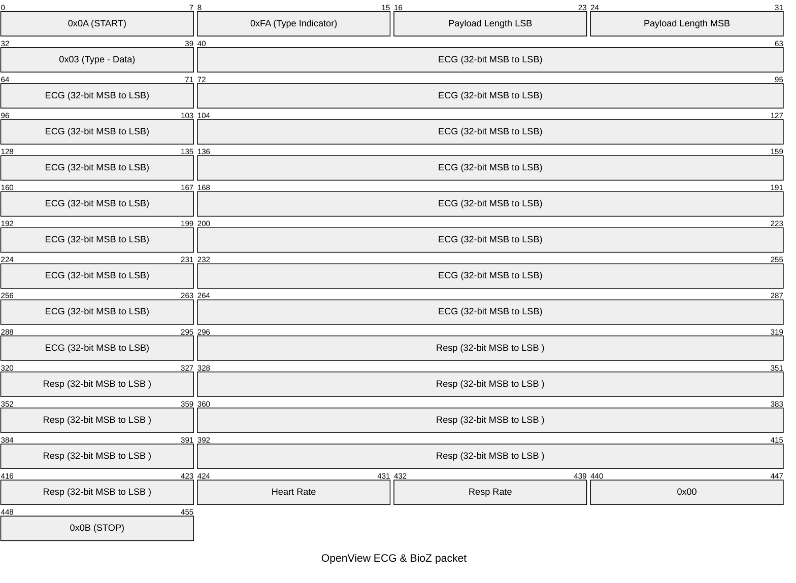
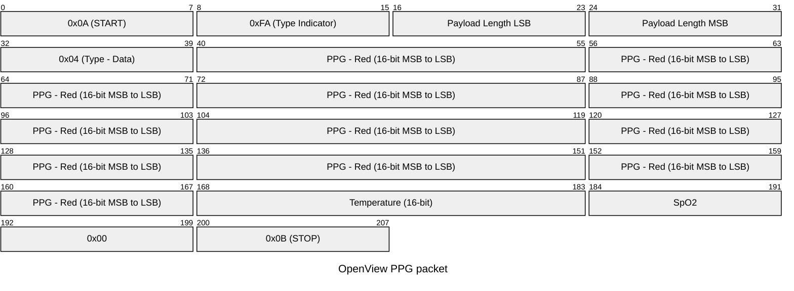

<div align="center">


# OpenView 3

**The companion app for ProtoCentral biosignal and sensor boards.**
Stream live data over USB, BLE or Wi-Fi · visualize it in real time · record it to `.hpd` · replay it later.

[](https://github.com/Protocentral/protocentral_openview/actions/workflows/release.yml)
[](#license)

[**Download**](https://github.com/Protocentral/protocentral_openview/releases) · [Supported boards](#supported-boards) · [Build from source](#build-from-source) · [Add your own board](#add-your-own-board)



*Live view — HealthyPi 5 streaming ECG, BioZ/respiration and PPG over BLE*

</div>

---

## What it does

OpenView 3 is a single app for every ProtoCentral board. It receives framed data from
the board, decodes it into signals, plots it live, and writes it to `.hpd` (BIOSIG v1)
files that round-trip with HealthyPi Studio.

It runs on **Windows, macOS, Linux, Android and iOS** from one Flutter codebase.

| | |
|---|---|
| **Live view** | Real-time plots of every channel the board exposes, with derived vitals (heart rate, SpO₂, respiration, temperature) shown alongside. |
| **Record & replay** | One-click recording to `.hpd`, a built-in recordings browser, and a replay screen that scrubs through past sessions. |
| **Device Manager** | Firmware and file management for any SMP/MCUmgr-enabled device over BLE — read image slots, upload firmware, browse the device filesystem. |
| **Console** | Raw packet stream with hex dump, including packets the app doesn't recognize — the first place to look when bringing up new firmware. |
| **Developer** | An unfiltered BLE GATT browser for poking at services and characteristics during bring-up. |

## Connecting

Three transports, gated per board — the app only offers what the board actually speaks.

| Transport | Availability |
|---|---|
| **USB / UART** | Every board. **Desktop only** (Windows, macOS, Linux). |
| **BLE** | HealthyPi 5, Sensything OX, Sensything CAP. All platforms. |
| **Wi-Fi (TCP)** | HealthyPi 5, Sensything OX, Sensything CAP. Enter `host:port` manually. |

## Supported boards

| Board | USB | BLE | Wi-Fi |
|---|:--:|:--:|:--:|
| [HealthyPi 5](https://protocentral.com/product/healthypi-5-vital-signs-monitoring-hat-kit/) | ✅ | ✅ | ✅ |
| Sensything OX | ✅ | ✅ | ✅ |
| Sensything CAP | ✅ | ✅ | ✅ |
| ADS1292R · ADS1293 · AFE4490 | ✅ | — | — |
| MAX30001 · MAX30003 · MAX86150 | ✅ | — | — |
| Pulse Express · TinyGSR | ✅ | — | — |
| TMF8829 dToF (depth map) | ✅ | — | — |

Don't see your board? It takes three files and no changes to the app — see
[Add your own board](#add-your-own-board).

## Install

### Desktop

Download the zip for your OS from the [Releases](https://github.com/Protocentral/protocentral_openview/releases)
page, extract it, and run the app.

### Mobile

<div align="center">

[](https://play.google.com/store/apps/details?id=com.protocentral.openview) [](https://apps.apple.com/fi/app/openview/id1667747246)

</div>

> **Note** — USB is not available on mobile. Use BLE or Wi-Fi.

## Screenshots

The same app, the same layout, everywhere — the navigation rail collapses to a bottom bar
on phones.

<div align="center">



*OpenView 3 on iPad (landscape)*

</div>

## Build from source

OpenView 3 is written in [Flutter](https://flutter.dev/) and is fully open source.

```bash
git clone https://github.com/Protocentral/protocentral_openview.git
cd protocentral_openview
flutter pub get
flutter run -d macos      # or windows / linux / <device-id>
```

Release builds:

```bash
flutter build macos       # or windows / linux / apk / ios
```

Linux additionally needs `libudev-dev`, `libgtk-3-dev`, `clang`, `cmake`, `ninja-build`
and `pkg-config`. See [.github/workflows/release.yml](.github/workflows/release.yml)
for the exact toolchain each platform is built with.

## Add your own board

A board is **declared, not coded**. Adding one touches three files and needs no changes
to the transport, protocol, UI or recording layers:

1. Declare a `BoardDescriptor` in `lib/boards/descriptors/<board>.dart` — its channels,
   packets, commands, and which transports it speaks.
2. Write pure decoder functions in `lib/boards/decoders/<board>_decoders.dart`
   (`Uint8List payload → DecodedPacket`).
3. Register the descriptor in `BoardRegistry.all`.

See [docs/ARCHITECTURE.md](docs/ARCHITECTURE.md) for the full data path
(Transport → Framer → Router → buffers → UI → Recorder).

## Wire format

Any device that can push bytes over UART/USB/BLE can talk to OpenView. The frame is:

| Position | Value |
|---|---|
| 0 | `0x0A` (start) |
| 1 | `0xFA` (type indicator) |
| 2 | Payload length LSB |
| 3 | Payload length MSB |
| 4 | Packet type |
| 5 … n | Payload |
| last | `0x0B` (stop) |

<details>
<summary><b>HealthyPi 5 packet layouts</b> (firmware ≥ 1.0.0 sends ECG/BioZ and PPG as separate packets)</summary>


```mermaid
  packet-beta
  title OpenView ECG & BioZ packet
   0-7: "0x0A (START)"
   8-15: "0xFA (Type Indicator)"
   16-23: "Payload Length LSB"
   24-31: "Payload Length MSB"
   32-39: "0x03 (Type - Data)"
   40-71: "ECG (32-bit MSB to LSB)"
   72-103: "ECG (32-bit MSB to LSB)"
   104-135: "ECG (32-bit MSB to LSB)"
   136-167: "ECG (32-bit MSB to LSB)"
   168-199: "ECG (32-bit MSB to LSB)"
   200-231: "ECG (32-bit MSB to LSB)"
   232-263: "ECG (32-bit MSB to LSB)"
   264-295: "ECG (32-bit MSB to LSB)"
   296-327: "Resp (32-bit MSB to LSB )"
   328-359: "Resp (32-bit MSB to LSB )"
   360-391: "Resp (32-bit MSB to LSB )"
   392-423: "Resp (32-bit MSB to LSB )"
   424-431: "Heart Rate"
   432-439: "Resp Rate"
   440-447: "0x00"
   448-455: "0x0B (STOP)"
```


```mermaid
  packet-beta
  title OpenView PPG packet
    0-7: "0x0A (START)"
    8-15: "0xFA (Type Indicator)"
    16-23: "Payload Length LSB"
    24-31: "Payload Length MSB"
    32-39: "0x04 (Type - Data)"
    40-55: "PPG - Red (16-bit MSB to LSB)"
    56-71: "PPG - Red (16-bit MSB to LSB)"
    72-87: "PPG - Red (16-bit MSB to LSB)"
    88-103: "PPG - Red (16-bit MSB to LSB)"
    104-119: "PPG - Red (16-bit MSB to LSB)"
    120-135: "PPG - Red (16-bit MSB to LSB)"
    136-151: "PPG - Red (16-bit MSB to LSB)"
    152-167: "PPG - Red (16-bit MSB to LSB)"
    168-183: "Temperature (16-bit)"
    184-191: "SpO2"
    192-199: "0x00"
    200-207: "0x0B (STOP)"
```

</details>

The TMF8829 depth-frame format is documented separately in
[docs/protocols/tmf8829-wire-format.md](docs/protocols/tmf8829-wire-format.md).

## Recording format

Recordings are written as `.hpd` files (BIOSIG v1) — a block-based, append-only format
that is binary-compatible with **HealthyPi Studio**, so files move freely between the
two apps.

## Device Manager (SMP / MCUmgr)

OpenView can manage any device that exposes the standard SMP service over BLE, built on
the [`mcumgr_dart`](https://pub.dev/packages/mcumgr_dart) package:

- **Device info** — echo, task/memory stats, image slots
- **Firmware** — list images and upload new ones
- **Files** — browse and transfer files on the device filesystem

> **Firmware upload works; the full DFU install flow (upload → test → reset → confirm)
> is still work-in-progress and labelled as advanced use in the app.**

## Version history

OpenView has been through three generations. This repository is the canonical home for
all of them:

| Version | Stack | Where |
|---|---|---|
| **OpenView 3** *(current)* | Flutter | `main` — this branch |
| OpenView 2 | Flutter | [`v2` branch](https://github.com/Protocentral/protocentral_openview/tree/v2), releases tagged `2.x` |
| OpenView 1 | Processing | [protocentral_openview_processing](https://github.com/Protocentral/protocentral_openview_processing) (archived) |

## License

MIT License — Copyright (c) 2019 ProtoCentral

Permission is hereby granted, free of charge, to any person obtaining a copy
of this software and associated documentation files (the "Software"), to deal
in the Software without restriction, including without limitation the rights
to use, copy, modify, merge, publish, distribute, sublicense, and/or sell
copies of the Software, and to permit persons to whom the Software is
furnished to do so, subject to the following conditions:

The above copyright notice and this permission notice shall be included in all
copies or substantial portions of the Software.

THE SOFTWARE IS PROVIDED "AS IS", WITHOUT WARRANTY OF ANY KIND, EXPRESS OR
IMPLIED, INCLUDING BUT NOT LIMITED TO THE WARRANTIES OF MERCHANTABILITY,
FITNESS FOR A PARTICULAR PURPOSE AND NONINFRINGEMENT. IN NO EVENT SHALL THE
AUTHORS OR COPYRIGHT HOLDERS BE LIABLE FOR ANY CLAIM, DAMAGES OR OTHER
LIABILITY, WHETHER IN AN ACTION OF CONTRACT, TORT OR OTHERWISE, ARISING FROM,
OUT OF OR IN CONNECTION WITH THE SOFTWARE OR THE USE OR OTHER DEALINGS IN THE
SOFTWARE.
